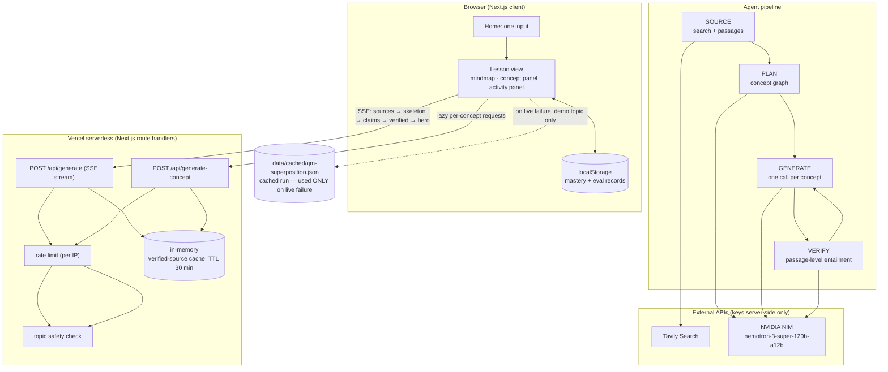

# EduVoid

**Type one question — "What do you want to learn?" — and get a cited, interactive learning app for that topic: a live mastery mindmap, parameter-driven simulations, sourced explanations, and quizzes whose results regenerate the concepts you missed in a different modality.**

Built for ForgeHacks 2026 (AI + Education track). No accounts, no database — all learning state lives in your browser.

> **Demo topic:** quantum superposition and measurement. The generic input works for any topic; polish effort is concentrated on this path.

---

## The problem

A motivated learner already has better explanations than a chatbot can improvise — university course notes, textbooks, papers. What they don't have is a way to *assemble* those sources into something they can actually interact with, and no way to know which statements are actually backed by a source versus plausible-sounding filler.

EduVoid's answer is not "ask an LLM to write a study guide". It is an agent pipeline that **sources, plans, generates, and then verifies** — every explanatory statement is tied to a specific source passage, unsupported claims are dropped, and the app shows you the agents' work.

## Who it's for

**Draft persona (needs owner confirmation — see `DECISIONS.md`):** a self-directed undergraduate revising a hard STEM topic before an assessment. They know how to search, but want a single interactive artifact that shows the prerequisite structure of the topic, lets them *predict-then-test* their intuition with sliders, and tells them honestly which claims came from where.

## What it does

1. You type a topic.
2. Agents search the web, rank sources by authority, extract atomic claims, and **cross-check** them against the passages they cite.
3. A planner produces a concept graph (prerequisites included) that renders immediately as a **skeleton mindmap**.
4. Each concept is generated on demand from the verified claims — an explanation, quizzes, flashcards, and a parameter-driven simulation.
5. Simulations **predict, then reveal**: you commit to a prediction before anything runs, then unlock an **explore lab** — sliders for the preparation or geometry, single-shot firing to build the statistics yourself, and (in the double-slit) a **which-path detector** toggle that visibly stops fringes from building.
6. Citations are clickable; contradictions are surfaced as "sources disagree".
7. Miss a quiz question and the concept **regenerates in a different modality** with a one-line reason ("You missed this, so here it is as a simulation") — the node recolors as mastery changes. If the live regeneration fails, a hand-built template sim takes over when one genuinely fits the concept (no fabricated experiments).
8. **Explain-back:** write the concept in your own words; the grader compares your text against that concept's verified claims one by one and names the claim you left out. Mastery moves from the result.
9. A built-in **test mode** (`/test`) runs a pre-test → learning session → post-test on **external** exam questions and exports per-participant scores as CSV.

## How this answers the AI + Education prompt

The track prompt asks for an AI-powered solution that helps learners move beyond memorization — to
**understand concepts, make connections, and apply what they learn**. Each one is a shipped
mechanic here:

- **Understand concepts.** Explanations are generated only from claims the verifier judged against
the passage they cite, and a missed quiz question regenerates the concept in a *different modality*
instead of repeating the text that already failed.
- **Make connections.** The planner emits a prerequisite graph and it streams as a mastery-coloured
mindmap before any prose exists — the topic's structure and the learner's gaps are visible together.
- **Apply what they learn.** Predict-then-reveal sims require a committed prediction before anything
runs; the sim lab lets the learner fire the experiment (including the which-path detector);
explain-back makes them produce the idea in their own words, graded against the concept's verified
claims. The external pre/post test carries one explicit application/transfer item per part.

The build timeline (first commit 2026-10-04, 38 commits through the Oct 8 closeout, AI coding tools
disclosed) and everything cached or adapted are stated in [`docs/DEVPOST.md`](docs/DEVPOST.md).

## Architecture



**Flow:** `topic → diagnose → SOURCE → PLAN → GENERATE (parallel, lazy) → VERIFY → RENDER (streamed) → ADAPT`, with quiz/behaviour feeding back into ADAPT.

## How the AI use goes beyond a wrapper

- **Passage-level evidence, not vibes.** Every claim cites passage IDs (not just source IDs). A deterministic check (no LLM) drops claims citing unknown passages; an LLM verifier then judges each claim **only** against the text of the passages it cites, returning `supported | unsupported | contradicted`. Flagged claims never ground generated content, and the UI shows a "verified against N sources" badge with a "sources disagree" state for contradictions.
- **Typed components, not free-form code.** The generator fills a fixed component library (explainer / sim / quiz / flashcards). The only generated code is **one** hero simulation per run, run in a locked-down `<iframe sandbox="allow-scripts">` with a `default-src 'none'` CSP, no network, no parent-DOM access, `postMessage`-only communication, and an automatic fallback to a hand-built template sim on any error.
- **A visible agent-activity panel** showing sources found, claims extracted, claims verified/rejected, and which agent is running.
- **Only components the app can actually render.** Generated content fills a fixed library; a template sim the hand-built code cannot draw is dropped rather than shown as a placeholder (`lib/sim-templates.ts` guards live generation, the cached run and the hero fallback).
- **A model spike with real numbers.** `nvidia/nemotron-3-super-120b-a12b` scored **10/10 valid JSON** and **caught 10/10 planted factual errors** against the real schemas, at a 5.1 s median — the only candidate that cleared both thresholds. Full method and the rejected candidates are in `DECISIONS.md`.

## Run it locally

Requires Node 22+ (the scripts use `node --experimental-strip-types`; verified on v22.23.1).

```bash
npm install
cp .env.example .env.local   # then fill in the values (see below)
npm run dev                  # http://localhost:3000
```

### Environment variables

All keys are **server-side only**; nothing is exposed to the browser. See `.env.example` for the annotated list.

| Variable | Purpose |
|---|---|
| `LLM_BASE_URL`, `LLM_API_KEY` | OpenAI-compatible endpoint + key (NVIDIA NIM in the demo) |
| `LLM_MODEL_DEFAULT` (+ per-role `LLM_MODEL_PLANNER` / `_GENERATOR` / `_VERIFIER` / `_GRADER`) | Role-based model routing |
| `LLM_DISABLE_THINKING` | Default `1`: structured calls skip the reasoning channel (see `DECISIONS.md`) |
| `SEARCH_PROVIDER`, `TAVILY_API_KEY` | Web search + built-in content extraction |

If the LLM/search keys are missing, routes return a visible "not configured" state — they never hang or crash.

### Useful scripts

```bash
npm run check          # typecheck + lint + vitest + production build
npm test               # vitest only
npm run capture:demo   # re-capture the demo-safe cached run from the real pipeline
```

## Deploy (Vercel)

1. Import the repo into Vercel; the framework preset is detected automatically.
2. Add the environment variables above to the project (Production + Preview).
3. Deploy. `maxDuration` is 300 s for `/api/generate` and 120 s for `/api/generate-concept`, and every individual model call has its own timeout well inside those.

**Pre-deploy checklist:** `npm run check` green → keys set in Vercel (never committed) → provider spend cap configured → demo topic loads live → cached-run path still works with the APIs unreachable → Vercel `maxDuration` matches the plan's limit.

## Trust, safety and cost controls

- **Keys stay server-side.** `.env.local` locally, project env vars on Vercel; nothing is exposed to the browser.
- **Per-IP rate limits** on every route that spends money: 6 generation requests / 10 min, 40 concept generations / 10 min, 20 explain-back grades / 10 min. Over the limit returns a friendly message with the wait time, never a hang.
- **Topic safety check (deterministic, before any provider call):** clearly harmful requests (weapons/explosives, dangerous-agent synthesis, illegal drugs, targeted harm) are refused with a friendly message and a suggestion — no lesson is generated. Five unseen topics were run on 2026-10-08 with zero crashes and one refusal verified (`PROGRESS.md`, "P3").
- **Abort on disconnect:** a closed tab cancels the in-flight model call instead of running it to completion.
- **Spend cap:** set at the provider (see the deploy checklist).

## Test mode, data, and the demo-safe run

- **Test mode** (`/test`) loads pre/post questions from [`data/eval/questions.json`](data/eval/questions.json). These are **external** questions — the app's own pipeline never generates them, and eval questions are kept separate in code from the in-app quizzes. Results are stored per participant in `localStorage` and exported as CSV. The committed instrument is 10 items (5 pre / 5 post): 4 verbatim from a CC BY-SA 4.0 question bank and 6 adapted from CC BY-NC-SA 4.0 course solutions and a textbook section, each keeping the source's own answer as the key with a quoted justification (`data/eval/procedure.md`). All six adapted keys are listed for the owner to verify in [`BLOCKERS.md`](BLOCKERS.md); **participant results: `[FILL IN AFTER SESSIONS]`** (sample size, pre/post means and the raw CSV go in `data/`).
- **Demo-safe cached run:** [`data/cached/qm-superposition.json`](data/cached/qm-superposition.json) is a real pipeline run for the demo topic, captured with `npm run capture:demo`. It is shown **only** when a live request fails and **only** for the demo topic, and is always labeled **"cached run"** in the UI. It is never presented as live and is never the default path.
- **Fixtures:** [`fixtures/qm-superposition.json`](fixtures/qm-superposition.json) is a fixture used by tests; fixtures are labeled wherever they appear.

## Honest limitations

- **Latency.** Five unseen topics on 2026-10-08: setup (sources → claims → verify → hero) 13-24 s and the first concept 2-8 s, because concepts generate lazily on open. Earlier demo-topic runs before those two optimizations were much slower (~90 s+ with all concepts up front); the owner's Oct 5 notes record 35-55 s setup on the demo topic, where the hero sim is still awaited before the stream finishes (logged post-freeze fix).
- **Source quality.** Search uses the provider's built-in content extraction; some pages extract garble (paywalls, JS-rendered content). Extraction failures degrade a single source, not the run.
- **Verification is entailment, not truth.** The verifier judges a claim only against the passage it cites. A source that is wrong but internally consistent passes, and the badge means "supported by these sources", not "objectively true".
- **No accounts, no cross-device state.** Learning state and test records live in one browser, by design. Test sessions are run on the owner's device so scores stay in one place.
- **Safety check is deterministic and shallow.** It refuses clearly harmful requests (weapons/explosives/dangerous-agent synthesis, illegal drugs, targeted harm) with a friendly message; it is not a general content policy.
- **Cost controls are basic.** Per-IP rate limiting (6 generation requests / 10 min) plus a provider spend cap — fine for a hackathon demo, not a production multi-tenant design.
- **Evaluation is a small demonstration, not a controlled study.** Participant numbers (n = `[FILL IN AFTER SESSIONS]`) are reported honestly in `PROGRESS.md` and `data/`; the sample size is tiny and one mixed result is reported as it happened.
- **Ambiguous one-word topics are the weak path.** Unseen-topic testing ("loops") showed the search results can be about a different sense of the word and still pass verification (entailment is per passage), so the lesson is thinly grounded. Type a specific multi-word topic; a claim-relevance gate is the next thing to build.
- **The eval questions are partly adapted, not all verbatim** — keep that in mind when quoting pre/post gains (`data/eval/procedure.md` §6).
- **This was built during the hackathon window** — see the commit history for the build progression.

## Repository layout

```
app/                     Next.js App Router (/, /test, API routes)
components/              UI: mindmap, concept panel, sims, hero sim, activity panel, notices
lib/                     pipeline (source/plan/generate/verify), spec schema, LLM + search,
                         rate limit, safety, cached run, mastery, eval, storage
scripts/                 model spike, probes, benchmarks, capture:demo
tests/                   vitest suites (214 tests)
docs/                    demo script, Q&A prep, Devpost text, eval-candidate research
data/cached/             the captured demo-safe run (committed)
data/eval/               external eval questions + procedure and provenance
fixtures/                test fixture spec
```

Design notes and the build log live at the repo root (`DECISIONS.md`, `PROGRESS.md`).

## Documentation

- [`docs/DEMO.md`](docs/DEMO.md) — the timed video script, the five tested topics and the fallback plan.
- [`docs/QA.md`](docs/QA.md) — answers to the six judge questions, from real project numbers.
- [`docs/DEVPOST.md`](docs/DEVPOST.md) — submission text mapped to the judging rubric.
- [`DECISIONS.md`](DECISIONS.md) — decisions, deviations, model-spike results, cut list.
- [`PROGRESS.md`](PROGRESS.md) — per-task build log with measured numbers.
- [`TASKS.md`](TASKS.md) — task list and acceptance criteria.
- [`BLOCKERS.md`](BLOCKERS.md) — open owner items.
- [`AGENTS.md`](AGENTS.md) — the build spec this project was built to.
